# Page 2: Projects

## The Pattern

From toys to systems. From joy to impact. A timeline of building since age 15.

---

## College Years: Research & Recognition (2013-2016)

### Research Publications

**Machine Learning for Microscopy** (2015)  
*IIT Kharagpur Research Internship*

Youngest intern in cohort. Published conference paper on deblurring fluorescence microscopy images using domain-adaptive autoencoders. First deep dive into ML/AI research.

**Astronomy Research** (2016)  
*Co-author with Dr. Randa Asa'd, AUS Physics Department*

Analyzed age determination of 12 Small Magellanic Cloud stellar clusters using integrated spectra. Published in Mem. S.A.It. Vol. 87.

### Leadership

**IEEE Student Branch, AUS** (2014-2016)  
*Event Organizer & Leader*

Organized 36 events across 5 semesters. Branch awarded **2nd Best Student Branch in UAE**.

### Academic Recognition

**Sheikh Khalifa Presidential Scholarship** (Junior Year, ~2015-2016)  
Best Overall Engineer of the batch. Recognition for excellence across academics, research, leadership, and extracurriculars.

**Chancellor's Scholarship** (Freshman Year, September 2013)  
75% tuition coverage. Awarded for outstanding extracurricular activities and out-of-the-box projects.

**Dean's List** (Every semester, 2013-2016)  
Fall 2013, Spring 2014, Fall 2014, Spring 2015, Fall 2015, Spring 2016

**Chancellor's List Gold**  
Highest academic honor tier — marked consistency and determination.

---

## High School Years: The Foundation (2012-2015)

### Age 18 (2014-2015)

**Robotics Workshop**  
Built line follower and obstacle avoidance robots using L293D drivers, infrared sensors, and motors. Learned C programming, PIC microcontrollers (MPLABS), and wireless control (XBEE). Rebuilt robots using code instead of pure circuits. Advanced to 3-axis accelerometer control. Completed 40-hour course in 20 hours. Started self-learning Arduino via YouTube.

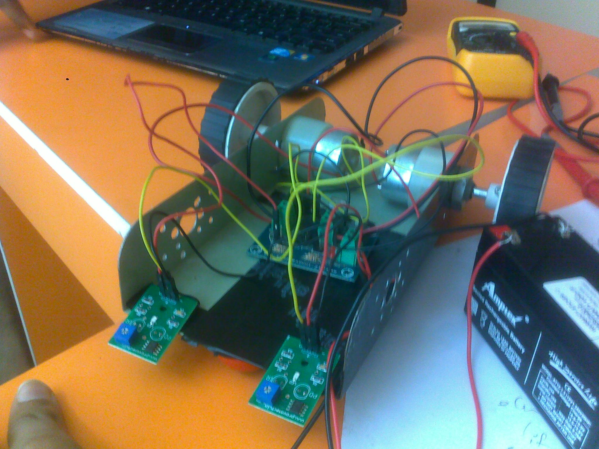

---

### Age 17 (2014)

**Infrared Camera Conversion**  
Hacked old camera into infrared camera by removing IR filter and adding photo film to block visible light. Could now see in the dark with an infrared LED — no lights needed.

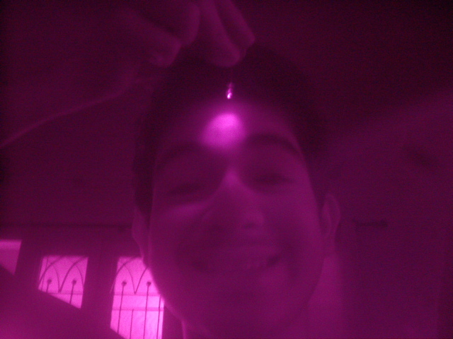
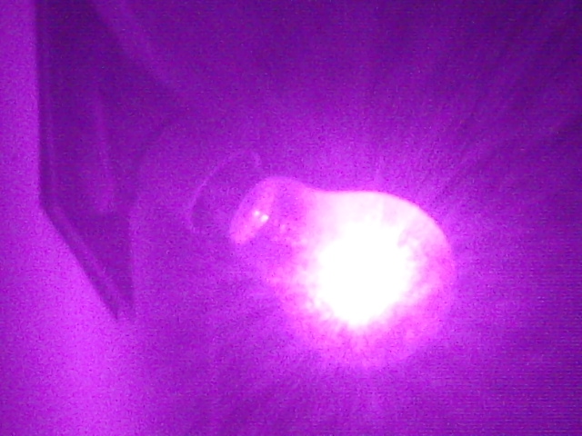

**Earphone Repair Mastery**  
Learned to replace 3.5mm audio jacks to avoid buying new earphones every 6 months. Biggest win: salvaged friend's broken Beats earphones ($99 retail) and repaired them for under $0.50 using an old AUX cable.

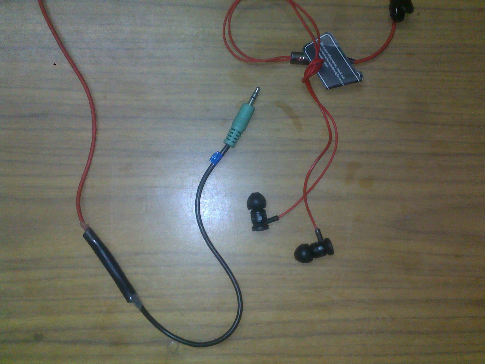

**LED Beats — Portable Version**  
Made the woofer LED project compact using a TIP 31 transistor, 2 LEDs, 3V button cell, and 3.5mm audio jack. Prototype for a bigger goal: entire room with beat-reactive lights.

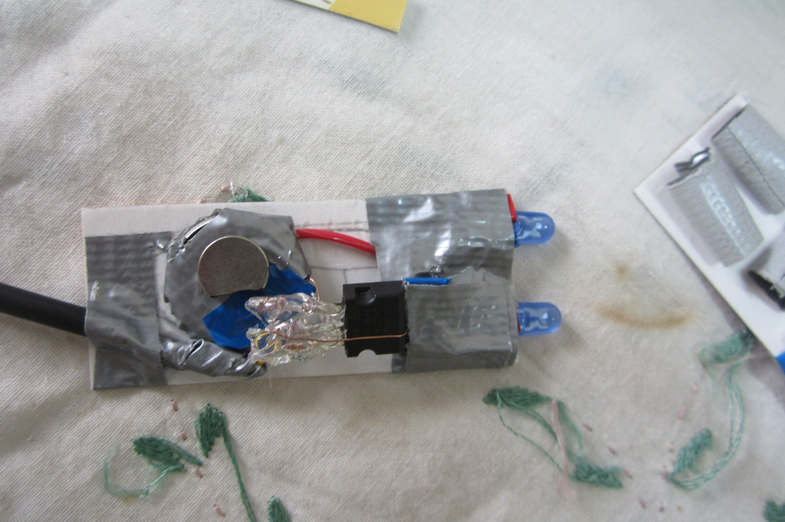

**Solar Panel Cell Phone Charger**  
Built "green" charger with 6V 8W solar panel, 5V regulator circuit (transistor + capacitors), and phone charging pin.

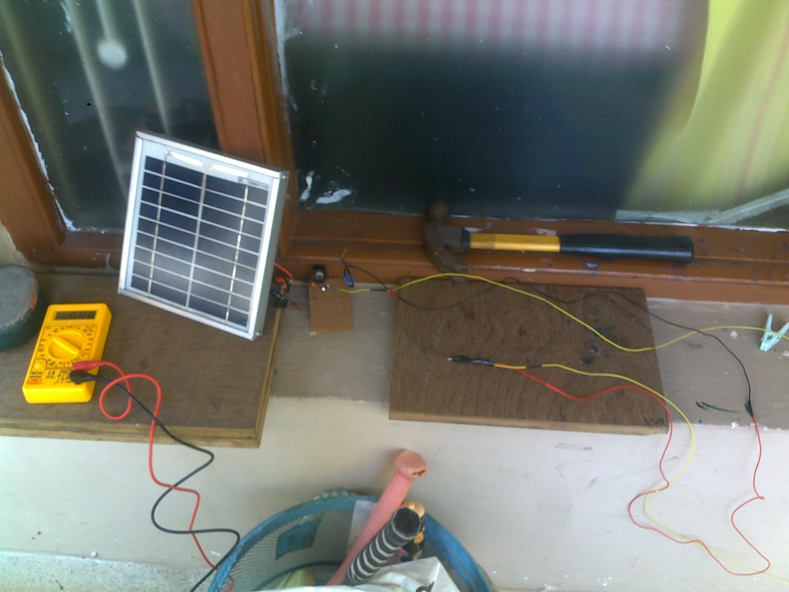

**Portable USB Charger**  
Frequent traveler solution: 5V regulator + female USB port + 9V battery. Casing made from repurposed food container. Compact and emergency-ready.

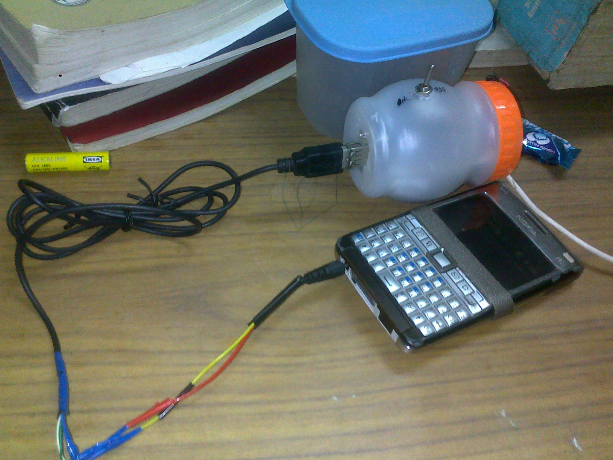

**Photo Stand**  
Handmade birthday gift with PVC board structure, 4 LEDs at vertices, and 10k potentiometer for variable brightness control. Battery holder attached with Velcro for easy replacement.

**555 Timer IC Circuit**  
First attempt at blinking LEDs with capacitors, resistors, and ICs. Failed initially. Tried again days later — success. Didn't fully understand it, but knew one thing: "I had advanced to the next level."

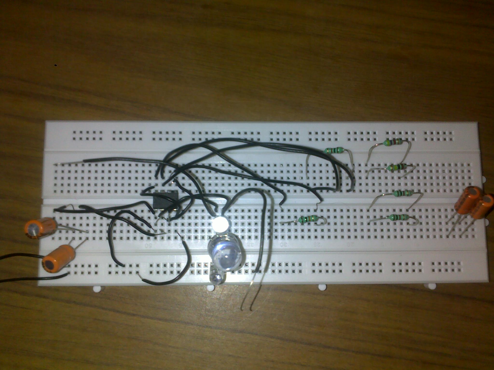

---

### Age 16 (2013)

**AIESEC Recruitment**  
Minimum age: 18. Howard's age: 16. VP of AIESEC Hyderabad initially refused. Showed portfolio of projects. **Result:** Recruited. Awarded kurta at first group meet (out of 30 people) for "most outstanding AIESEC'er."

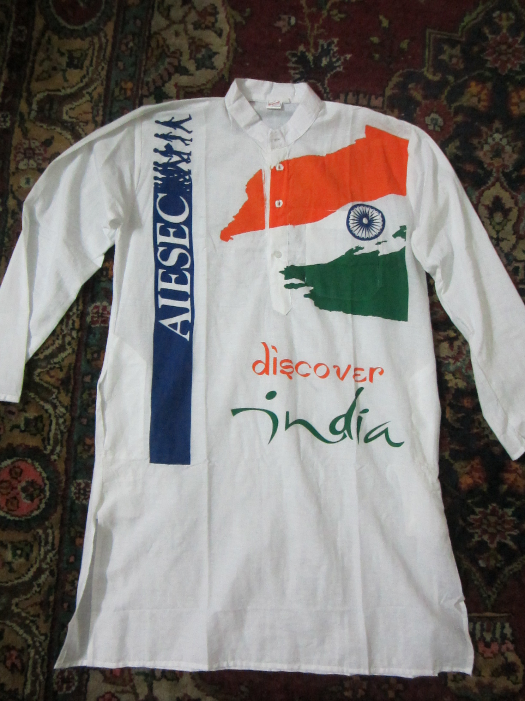

**LED Beats — Woofer Version**  
Made listening to music more exciting by connecting 9 LEDs in series to subwoofer. LEDs pulsed with the beat. Later upgraded with 28 white LEDs salvaged from broken emergency light, mounted on curtain rod. Turned room into "mini disco."

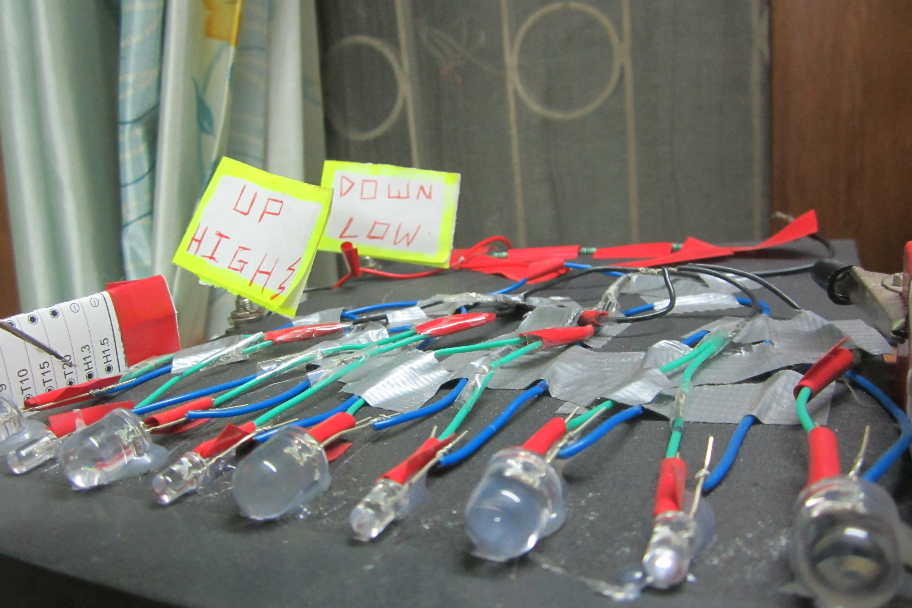

**Arc Reactor Model**  
Inspired by Iron Man. Salvaged parts from old VCR player mom was throwing away. Installed alternating blue and white LEDs. Too heavy to wear on chest, but kept as inspiration.

**Photo Frame Gift**  
Handmade birthday gift: cardboard frame with blue and white LEDs wired in series. Magnetic attachment system allowed photo swaps. Out-of-the-box thinking applied.

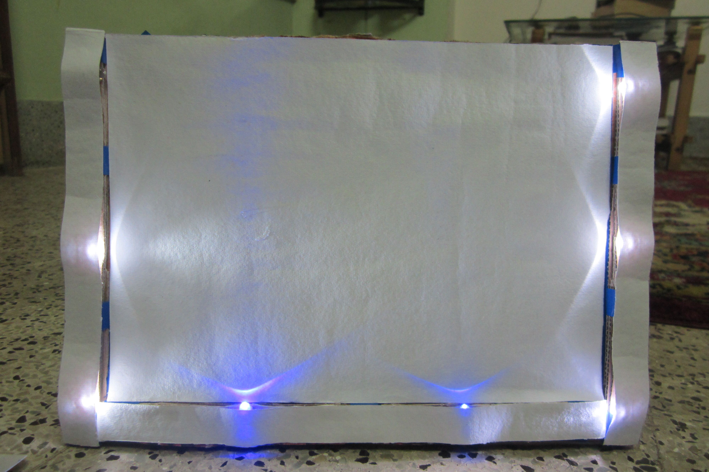

**Portable Fan**  
Problem: 2-hour power cuts at school. Solution: Extracted 1.5V CD-ROM motor, added 4-battery holder and clip. Later improved with better base and magnetic mounting.

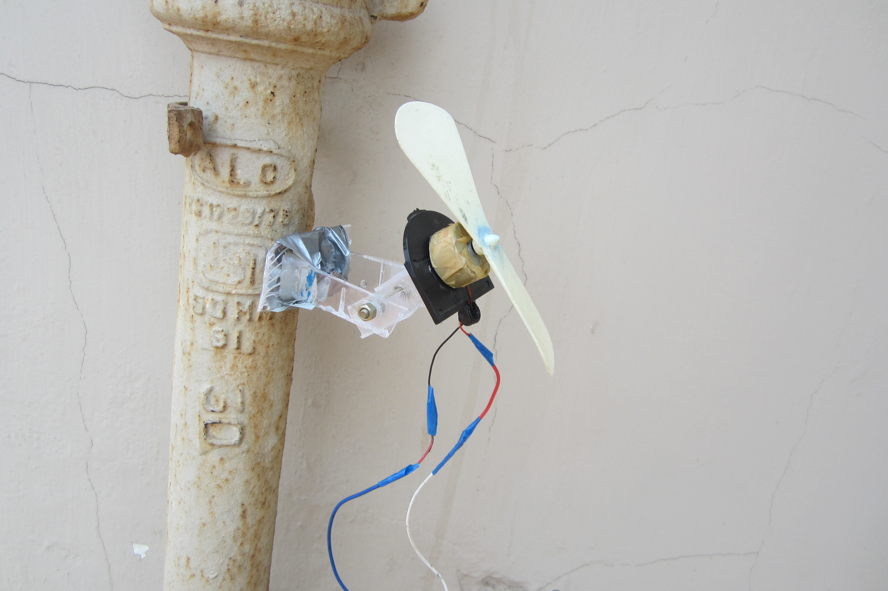

---

### Age 15 (2012)

**Monster Truck LED Add-ons**  
First documented project. Added 3 LEDs in parallel to RC monster truck with battery holder and switch. Velcro-mounted battery for easy replacement after high-impact crashes.

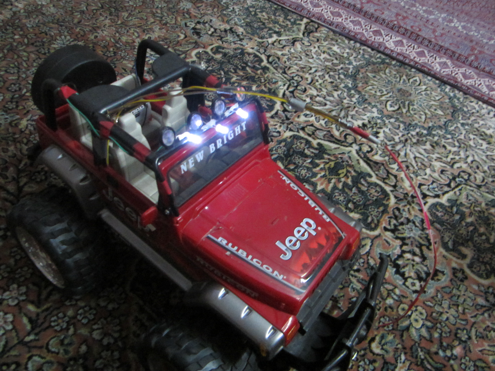

---

## Design Notes

- **Timeline format** — Chronological, reverse order (most recent first)
- **Visual hierarchy** — College achievements featured prominently, high school projects grouped by age
- **Storytelling** — Each project tells a mini-story: problem → solution → learning
- **Pattern highlight** — Opening section shows evolution from toys → systems → impact
- **Academic credentials** — Research papers, scholarships, leadership roles upfront
- **Images** — Each high school project includes 1-2 representative photos from scholarship portfolios
- Consider: Interactive timeline with expandable project cards, hover effects on images, lightbox galleries

---

**Status:** Draft with images — ready for review  
**Last updated:** 2026-02-24
